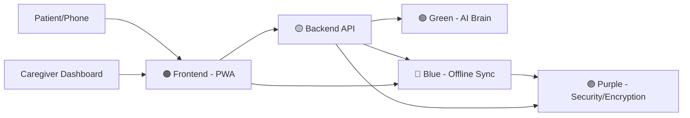

# 🌿 Amoha - Dementia Care Hub (SIH Project)

> **Team Mustangs** 🐎

## 🎯 Project Vision

**Amoha** is a free, offline-first, voice-guided web app designed for dementia caregivers in India's North Eastern Region (NER).
It replaces 5+ scattered apps with **1 simple link** that works on low-end phones, spotty 3G, and even without the internet.

---

## 👥 Meet the Team

Our team works together like LEGO blocks — each member owns a distinct color-coded role.

| Color | Role | What They Own |
|-------|------|---------------|
| 🔴 **Red** | Project Lead & Integration | Keeps everyone on track, manages deadlines, integrates all modules |
| 🟠 **Orange** | Frontend & UI/UX Lead | Builds the simple, big-button, voice-guided screens |
| 🟡 **Yellow** | Backend & Database Lead | Builds APIs and data plumbing (PostgreSQL, FastAPI) |
| 🟢 **Green** | AI/ML & Personalization Lead | Builds the "brain" that reads text and gives suggestions |
| 🔵 **Blue** | Offline & Connectivity Lead | Makes the app work without internet + background sync |
| 🟣 **Purple** | Security & Compliance Lead | Protects patient data, OTP login, PDPP Act compliance |

---

## 🧱 High-Level Architecture



**The Golden Rule:**
- Orange builds the **screens** the user sees.
- Yellow builds the **pipes** (APIs) that move data.
- Green builds the **brain** that reads text and gives advice.
- Blue ensures everything works **without the internet**.
- Purple makes sure patient data is **private and safe**.
- Red makes sure all 5 pieces fit together by **September 11**.

---

## 🗂️ Project Folder Structure

```
SIH/
├── README.md                 (This file!)
├── PROJECT_DESCRIPTION.md
├── requirements.txt
├── amoha_ai/                 (🟢 Green's folder)
│   ├── data/
│   ├── brain.py
│   ├── test_brain.py
│   └── README_GREEN.md
├── frontend/                 (🟠 Orange's folder)
├── backend/                  (🟡 Yellow's folder)
├── offline/                  (🔵 Blue's folder)
├── security/                 (🟣 Purple's folder)
└── integration/              (🔴 Red's folder)
```

---

## 📅 Important Dates

- **Sept 4:** Project Kickoff
- **Sept 5-10:** Development Sprint
- **Sept 11:** ROUND 1 SUBMISSION (Demo day!)

---

## 🎯 Success Criteria

1. One link opens the app instantly on a phone.
2. No internet? Still works (offline-first).
3. Caregiver types *"Grandma is restless"* → app says *"Agitation detected, try calming music"*.
4. The UI is **huge**, **bright**, and **speaks** to the user.
5. A caregiver dashboard shows simple trends.

---

> *"Together, we build a bridge of care for dementia patients in the North East."* — Team Mustangs
